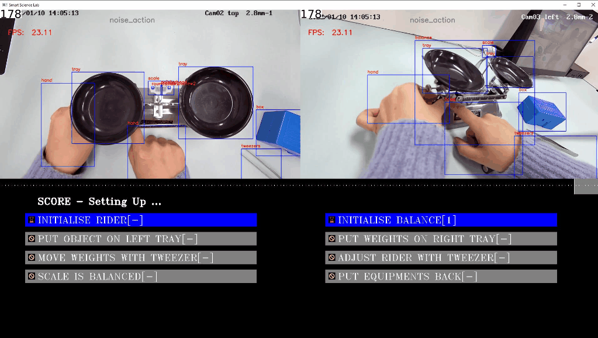

# Smartlab Python\* Demo

This is the demo application with smartlab object detection and smartlab action recognition algorithms.
This demo takes multi-view video inputs to identify objects and actions, then evaluates scores for teacher's reference.
The UI is shown as:

**The left picture** and **right picture** show top view and side view on the test bench respectively. For object detection part,
**blue bounding boxes** are shown. Below these pictures, **progress bar** is shown for action types, and the colors of actions correspond to
the **action names** above. Scoring part is below the entire UI and there are 8 score points. `[1]` means student can
get 1 point while `[0]` means student loses the point. `[-]` means under evaluation.

## Algorithms
Architecture of smart science lab contains object detection, action recognition and scoring evaluator.
The following pre-trained models are delivered with the product:

* `smartlab-object-detection-0001` + `smartlab-object-detection-0002` + `smartlab-object-detection-0003` + `smartlab-object-detection-0004`, which are models
  to detect 10 objects including: balance, weights, tweezers, box, battery, tray, ruler, rider, scale, hand.

Action recognition include two options:
* --mode multiview: `smartlab-sequence-modelling-0001` + `smartlab-sequence-modelling-0002`, identifying actions 13 action types.
* --mode mstcn: `smartlab-action-recognition-0001-encoder-top` + `smartlab-action-recognition-0001-encoder-side` +
  `smartlab-action-recognition-0001-decoder` , identifying actions 3 action types.

## How It works

The demo pipeline consists of several steps:

* `Decode` read frames from the two input videos
* `Detector` detect objects (balance, weights, tweezers, box, battery, tray, ruler, rider scale, hand)
* `Segmentor` segment and classify video frames based on action type of the frame
* `Evaluator` give scores of the current state
* `Display` displays the whole UI

## Preparing to Run
Example input video: https://storage.openvinotoolkit.org/data/test_data/videos/smartlab/v3).

The list of models supported by the demo is in `<omz_dir>/demos/smartlab_demo/python/models.lst` file.
This file can be used as a parameter for [Model Downloader](../../../tools/model_tools/README.md) to download.
An example of using the Model Downloader:
```sh
omz_downloader --list models.lst
```

### Supported Models
* smartlab-object-detection-0001
* smartlab-object-detection-0002
* smartlab-object-detection-0003
* smartlab-object-detection-0004
* smartlab-sequence-modelling-0001
* smartlab-sequence-modelling-0002
* smartlab-action-recognition-0001-encoder-top
* smartlab-action-recognition-0001-encoder-side
* smartlab-action-recognition-0001-decoder


> **NOTE**: Refer to the tables [Intel's Pre-Trained Models Device Support](../../../models/intel/device_support.md) for
> the details on models inference support at different devices.

## Running

Running the demo with `-h` shows this help message:
```
usage: smartlab_demo.py [-h] [-d DEVICE] -tv TOPVIEW -sv SIDEVIEW -m_ta M_TOPALL -m_tm M_TOPMOVE -m_sa M_SIDEALL
                        -m_sm M_SIDEMOVE -m_de M_DECODER -m_en M_ENCODER [-m_en_t M_ENCODER_TOP -m_en_s M_ENCODER_SIDE]

Options:
  -h, --help            Show this help message and exit.
  -d DEVICE, --device DEVICE
                        Optional. Specify the target to infer on CPU or GPU.
  -tv TOPVIEW, --topview TOPVIEW
                        Required. Topview stream to be processed. The input must be a single image, a folder of images, video file or
                        camera id.
  -sv SIDEVIEW, --sideview SIDEVIEW
                        Required. SideView to be processed. The input must be a single image, a folder of images, video file or camera
                        id.
  -m_ta M_TOPALL, --m_topall M_TOPALL
                        Required. Path to topview all class model.
  -m_tm M_TOPMOVE, --m_topmove M_TOPMOVE
                        Required. Path to topview moving class model.
  -m_sa M_SIDEALL, --m_sideall M_SIDEALL
                        Required. Path to sidetview all class model.
  -m_sm M_SIDEMOVE, --m_sidemove M_SIDEMOVE
                        Required. Path to sidetview moving class model.
  --mode MODE           Optional. Action recognition mode: multiview or mstcn
  -m_en_t M_ENCODER_TOP, --m_encoder_top M_ENCODER_TOP
                        Required for multiview mode. Path to encoder model for topview.
  -m_en_s M_ENCODER_SIDE, --m_encoder_side M_ENCODER_SIDE
                        Required for multiview mode. Path to encoder model for sideview.
  -m_de M_DECODER, --m_decoder M_DECODER
                        Required for both multiview and mstcn mode. Path to decoder model.
  -m_en M_ENCODER, --m_encoder M_ENCODER
                        Required for mstcn mode. Path to encoder model.
```

For example, run the demo with multiview mode:
```sh
python3 smartlab_demo.py
    -tv stream_1_top.mp4
    -sv stream_1_left.mp4
    -m_ta "./intel/smartlab-object-detection-0001/FP32/smartlab-object-detection-0001.xml"
    -m_tm "./intel/smartlab-object-detection-0002/FP32/smartlab-object-detection-0002.xml"
    -m_sa "./intel/smartlab-object-detection-0003/FP32/smartlab-object-detection-0003.xml"
    -m_sm "./intel/smartlab-object-detection-0004/FP32/smartlab-object-detection-0004.xml"
    -m_en_t "./intel/smartlab-action-recognition-0001-encoder-top/FP32/smartlab-action-recognition-0001-encoder-top.xml"
    -m_en_s "./intel/smartlab-action-recognition-0001-encoder-side/FP32/smartlab-action-recognition-0001-encoder-side.xml"
    -m_de "./intel/smartlab-action-recognition-0001-decoder/FP32/smartlab-action-recognition-0001-decoder.xml"
```
run the demo with mstcn mode:
```sh
python3 smartlab_demo.py
    -tv stream_1_top.mp4
    -sv stream_1_left.mp4
    -m_ta "./intel/smartlab-object-detection-0001/FP32/smartlab-object-detection-0001.xml"
    -m_tm "./intel/smartlab-object-detection-0002/FP32/smartlab-object-detection-0002.xml"
    -m_sa "./intel/smartlab-object-detection-0003/FP32/smartlab-object-detection-0003.xml"
    -m_sm "./intel/smartlab-object-detection-0004/FP32/smartlab-object-detection-0004.xml"
    -m_en "./intel/sequence_modelling/FP32/smartlab-sequence-modelling-0001.xml"
    -m_de "./intel/sequence_modelling/FP32/smartlab-sequence-modelling-0002.xml"
```

## Demo Output

The application uses OpenCV to display the online results.

## See Also

* [Open Model Zoo Demos](../../README.md)
* [Model Downloader](../../../tools/model_tools/README.md)
